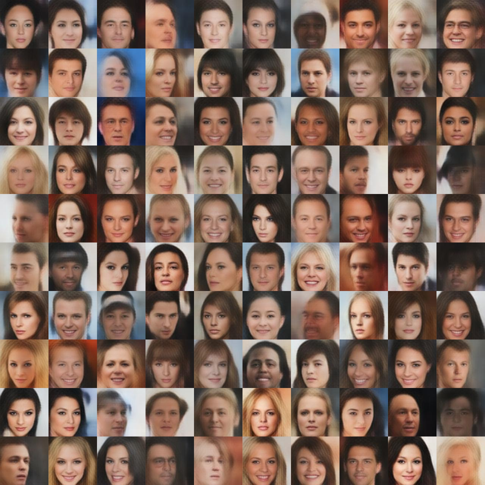

# DFC-VAE

This is the code for the paper

**[Deep Feature Consistent Variational Autoencoder](https://houxianxu.github.io/assets/project/dfcvae)**

The paper trained a Variational Autoencoder (VAE) model for face image generation. In addition, it provided a method to manipluate facial attributes by using attribute-specific vector.
<!--  -->

- Pretrained model trained on [CelebA dataset](http://mmlab.ie.cuhk.edu.hk/projects/CelebA.html)
- Code for training on GPU
- Code for different analysis

## Installation
Our implementation is based on [Torch](http://torch.ch/) and several dependencies.

After installing Torch according to [this tutorial](http://torch.ch/docs/getting-started.html), use following code to install dependencies:

```bash
sudo apt-get install libprotobuf-dev protobuf-compiler
luarocks install loadcaffe
luarocks install https://raw.githubusercontent.com/szym/display/master/display-scm-0.rockspec
luarocks install nngraph
sudo apt-get install libmatio2
luarocks install matio
luarocks install manifold
sudo apt-get install libatlas3-base # for manifold
```

we use a NVIDIA GPU for training and testing, so you also need install GPU related packages

```bash
luarocks install cutorch
luarocks install cunn
luarocks install cudnn
```

## Dataset preparation

```bash
cd celebA
```
Download img_align_celeba.zip from http://mmlab.ie.cuhk.edu.hk/projects/CelebA.html under the link "Align&Cropped Images".

Download list_attr_celeba.txt for annotation.

```bash
unzip img_align_celeba.zip; cd ..
DATA_ROOT=celebA th data/crop_celebA.lua
```

We need pretrained VGG-19 to compute feature perceptual loss.
```
cd data/pretrained && bash download_models.sh && cd ../..
```

## Training

Open a new terminal and start the server for display images in the browser
```bash
th -ldisplay.start 8000 0.0.0.0
```
The images can be seen at http://localhost:8000 in the browser

Training with feature perceptual loss.
```bash
DATA_ROOT=celebA th main_cvae_content.lua
```

Training with pixel-by-pixel loss.
```bash
DATA_ROOT=celebA th main_cvae.lua
```

## Generate face images using pretrained Encoder and Decoder

### Pretrained model

```bash
mkdir checkpoints; cd checkpoints
```

We provide both **Encoder** and **Decoder**

[cvae_content_123_encoder.t7](https://drive.google.com/open?id=0B2Nu6PGoZ7p4UDRpYUcxOW9Rd2s) and [cvae_content_123_decoder.t7](https://drive.google.com/open?id=0B2Nu6PGoZ7p4ZHRMTnFrUXVIck0) trained with relu1_1, relu2_1, relu3_1 in VGG.


Reconstruction with CelebA dataset:
```bash
DATA_ROOT=celebA reconstruction=1 th generate.lua
```

Face images randomly generated from latent variables:
```bash
DATA_ROOT=celebA reconstruction=0 th generate.lua
```

Following are some examples:
<div align='center'>
	
</div>
## Linear interpolation between two face images

```bash
th linear_walk_two_images.lua
```
<!--  -->
<div align='center'>
	
</div>
## Vector arithmetic for visual attributes

First preprocess the celebA dataset annotations to separate the dataset to two parts for each attribute, indicating whether containing the specific attribute or not.

```bash
cd celebA
python get_binary_attr.py
# should generate file: 'celebA/attr_binary_list.txt'
cd ..
th linear_walk_attribute_vector.lua
```

Here are some examples:
<div align='center'>
	
</div>
<!--  -->

## Credits

The code is based on [neural-style](https://github.com/jcjohnson/neural-style), [dcgan.torch](https://github.com/soumith/dcgan.torch), [VAE-Torch](https://github.com/y0ast/VAE-Torch) and [texture_nets](https://github.com/DmitryUlyanov/texture_nets).


